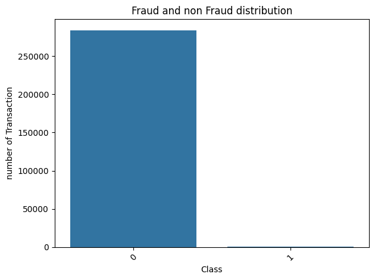
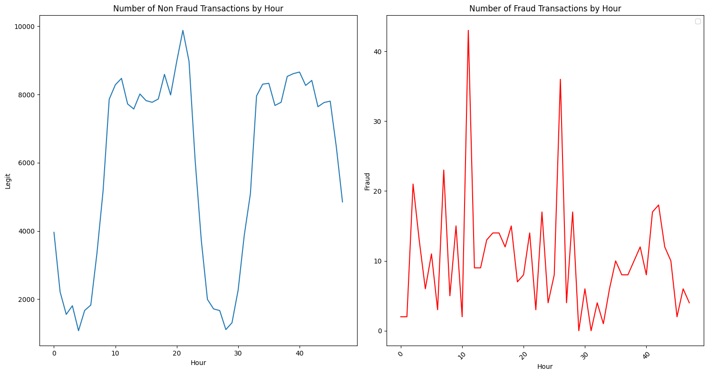
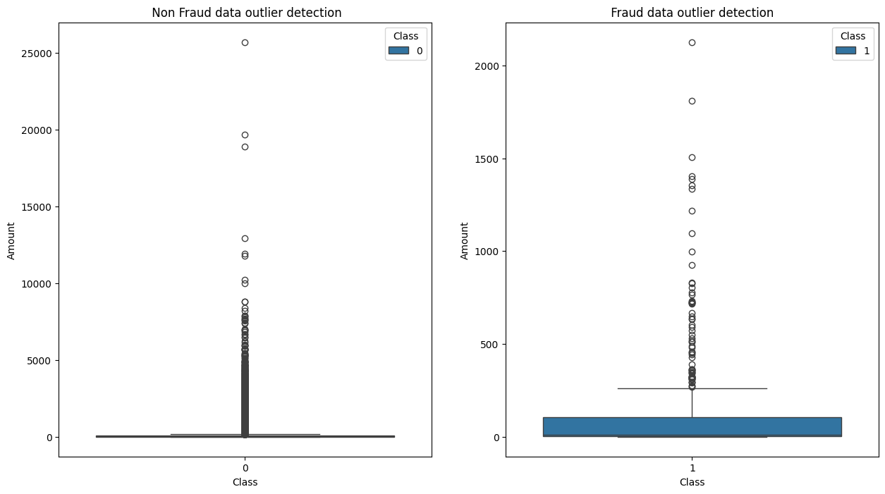
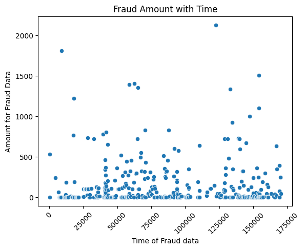
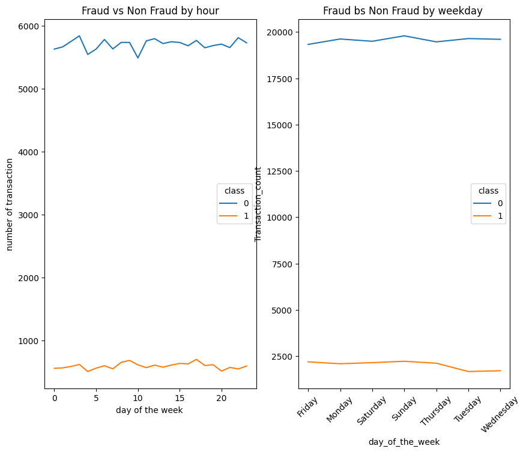
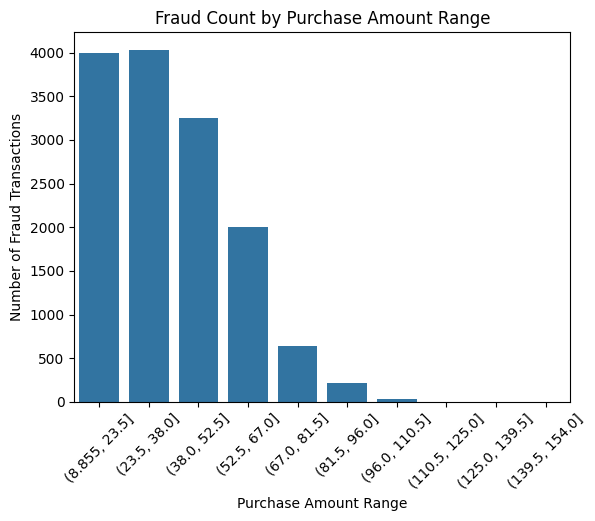

# Improved Fraud Detection for E-commerce and Bank Transactions

This project focuses on enhancing the detection of fraudulent activities in e-commerce and bank credit transactions using advanced machine learning techniques. Developed by Adey Innovations Inc., this solution aims to improve transaction security, prevent financial losses, and build customer trust.

## Overview

The financial technology sector faces significant challenges in identifying and mitigating fraud. This project addresses the need for accurate and robust fraud detection models capable of handling the unique characteristics of both e-commerce and bank transaction data. It incorporates geolocation analysis and transaction pattern recognition to further improve detection capabilities. A key challenge is balancing security with user experience, minimizing false positives while effectively catching fraudulent transactions.

## Data and Features

Two primary datasets are utilized in this project:

### `Fraud_Data.csv` (E-commerce Transactions)

This dataset contains e-commerce transaction data, including:

  * **`user_id`**: Unique identifier for the user.
  * **`signup_time`**: Timestamp of user signup.
  * **`purchase_time`**: Timestamp of the purchase.
  * **`purchase_value`**: Value of the purchase in dollars.
  * **`device_id`**: Unique identifier for the device used.
  * **`source`**: User acquisition channel (e.g., SEO, Ads).
  * **`browser`**: Browser used for the transaction.
  * **`sex`**: User's gender (M/F).
  * **`age`**: User's age.
  * **`ip_address`**: IP address of the transaction.
  * **`class`**: Target variable (1 for fraudulent, 0 for non-fraudulent).

**Critical Challenge**: Class Imbalance – The dataset has significantly fewer fraudulent transactions, requiring specialized evaluation metrics and modeling techniques.

### `creditcard.csv` (Bank Transaction Data)

This dataset contains anonymized bank credit card transactions:

  * **`Time`**: Seconds elapsed between the transaction and the first transaction in the dataset.
  * **`V1` to `V28`**: Anonymized principal components obtained via PCA, representing underlying data patterns.
  * **`Amount`**: Transaction amount in dollars.
  * **`Class`**: Target variable (1 for fraudulent, 0 for non-fraudulent).

**Critical Challenge**: Class Imbalance – Similar to the e-commerce data, this dataset is highly imbalanced.

### `IpAddress_to_Country.csv`

This supplementary dataset maps IP addresses to countries:

  * **`lower_bound_ip_address`**: Lower bound of the IP address range.
  * **`upper_bound_ip_address`**: Upper bound of the IP address range.
  * **`country`**: Corresponding country.

## Learning Outcomes

### Skills

  * Effective cleaning, preprocessing, and merging of complex datasets.
  * Feature engineering from raw data.
  * Techniques for handling highly imbalanced datasets.
  * Model training and evaluation using appropriate metrics (AUC-PR, F1-Score).
  * Interpretation and visualization of model predictions using SHAP.

### Knowledge

  * Understanding business and technical challenges of fraud detection.
  * Importance of Model Explainability (XAI).
  * Justifying model selection based on performance and business context.

### Behaviors

  * Adopting a business-centric approach.
  * Systematic and organized workflow from data analysis to interpretation.

### Communication

  * Reporting on statistically complex issues.
## Instructions

### Task 1 - Data Analysis and Preprocessing

  * **Handle Missing Values**: Impute or drop missing values.
  * **Data Cleaning**: Remove duplicates, correct data types.
  * **Exploratory Data Analysis (EDA)**: Univariate and bivariate analysis.
  * **Merge Datasets for Geolocation Analysis**: Convert IP addresses to integer format and merge `Fraud_Data.csv` with `IpAddress_to_Country.csv`.
  * **Feature Engineering**:
      * Transaction frequency and velocity for `Fraud_Data.csv`.
      * Time-Based features for `Fraud_Data.csv` (hour of day, day of week, `time_since_signup`).
  * **Data Transformation**:
      * Handle Class Imbalance: Analyze class distribution and apply appropriate sampling techniques (e.g., SMOTE, Random Undersampling) to training data only.
      * Normalization and Scaling (e.g., StandardScaler, MinMaxScaler).
      * Encode Categorical Features (e.g., One-Hot Encoding).

### Task 2 - Model Building and Training

  * **Data Preparation**: Separate features and target (`Class` for `creditcard.csv`, `class` for `Fraud_Data.csv`) and perform train-test split.
  * **Model Selection**: Build and compare two models:
      * **Logistic Regression**: As a simple, interpretable baseline.
      * **One Powerful Ensemble Model**: Random Forest or a Gradient Boosting model (e.g., LightGBM, XGBoost).
      * *(From analysis of `credit_fraud.ipynb` and `fraud_data.ipynb`, both Logistic Regression and Random Forest models were implemented and evaluated.)*
  * **Model Training and Evaluation**: Train models on both datasets. Use appropriate metrics for imbalanced data (AUC-PR, F1-Score, Confusion Matrix). Justify the "best" model selection.
      * *(Evaluation metrics such as `accuracy_score`, `precision_score`, `recall_score`, `f1_score`, `roc_auc_score`, `confusion_matrix`, and `average_precision_score` were used in the provided notebooks.)*

### Task 3 - Model Explainability

  * Use SHAP (Shapley Additive exPlanations) to interpret the best-performing model.
  * Generate and interpret SHAP plots (e.g., Summary Plot, Force Plot) to understand global and local feature importance. Explain what these plots reveal about fraud drivers in the final report.

### Interim - 1 Submission (Sunday, July 20, 2025)

  * **Focus**: Confirm basic understanding and initial analysis (Task 1).
  * **What to Submit**:
      * Link to GitHub repository.
      * Detailed Report: Summary of data cleaning/preprocessing, EDA insights and visualizations, explanation of feature engineering choices (time\_since\_signup, IP address-to-country mapping), analysis of class imbalance and proposed strategy.

### Interim - 2 Submission (Sunday, July 27, 2025)

  * **Focus**: Confirm successful model building and evaluation (Task 2).
  * **What to Submit**:
      * Link to GitHub repository (reflecting completion of modeling task).

### Final Submission (Tuesday, July 29, 2025)

  * **Focus**: Complete, well-documented, and deployable end-to-end project.
  * **What to Submit**:
      * Polished Blog Post (e.g., on Medium) or formal PDF Report: Narrate the project story, include data analysis, feature engineering, visualizations, model performance comparison with justification, and screenshots/interpretation of SHAP plots.
      * Link to final GitHub repository: Must be professional and self-contained, including a comprehensive `README.md` and organized code.

## References

### Fraud Detection

  * Kaggle Dataset: Credit Card Fraud Detection
  * Kaggle Competition: IEEE Fraud Detection
  * Kaggle Dataset: Fraud E-commerce
  * What is Fraud Detection? - ComplyAdvantage
  * What is Fraud Detection? - Spiceworks

### Modeling

  * Conceptual Understanding of Logistic Regression - Analytics Vidhya
  * Decision Tree Algorithm - Analytics Vidhya
  * Understanding Random Forest - Analytics Vidhya
  * Guide to the Gradient Boosting Algorithm - DataCamp
  * Multilayer Perceptrons in Machine Learning - DataCamp
  * Introduction to Convolutional Neural Networks (CNNs) - DataCamp
  * Convolutional Neural Networks Explained - Towards Data Science
  * IBM Topics: Recurrent Neural Networks
  * A Brief Overview of Recurrent Neural Networks (RNN) - Analytics Vidhya
  * Introduction to Long Short-Term Memory (LSTM) - Analytics Vidhya
  * A Gentle Introduction to Long Short-Term Memory Networks - Machine Learning Mastery

### Model Explainability

  * Model Explainability in AI - Larksuite
  * Model Explainability - Analytics Vidhya
  * IBM Topics: Explainable AI
  * Explainable AI: Understanding and Trusting Machine Learning Models - DataCamp

### Flask and Dash

  * Flask Documentation
  * Flask Tutorial - GeeksforGeeks
  * Python Dash - Real Python
  * Dash Layout - Plotly

## Images

*(Note: To display these images in your GitHub README, please ensure they are located in the `image/` directory relative to your README.md file. You will need to manually add these image files to your repository.)*

